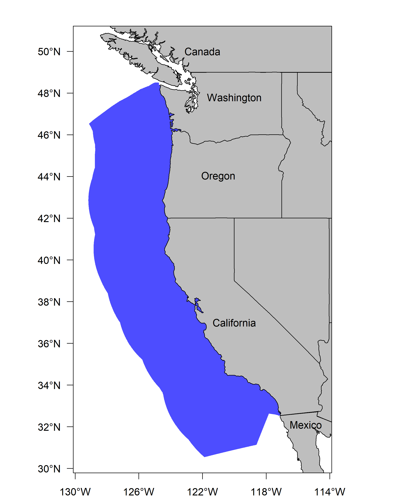
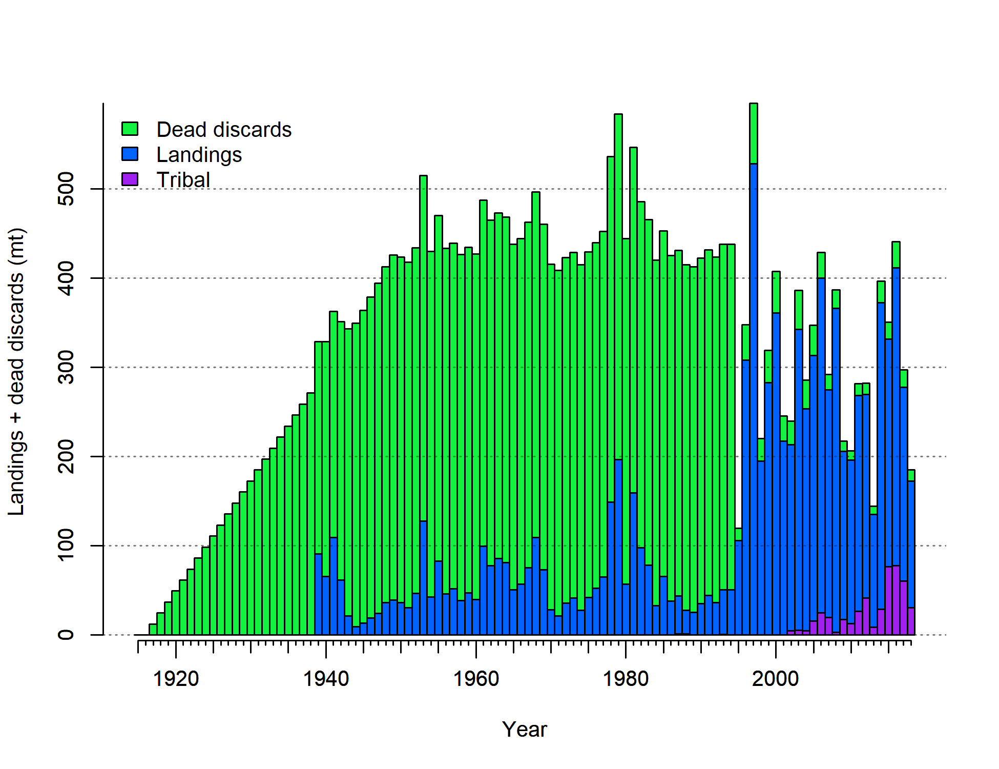

# Executive Summary{-}

## Stock{-}

This assessment reports the status of the `r spp` (\emph{`r spp.sci`}) resource in U.S. waters off the West Coast using data through `r LastYR`.
A map showing the area of the U.S. West Coast Exclusive Economic Zone covered by this stock assessment is provided in Figure \ref{fig:assess_region_map}.

<!-- [H] to control floating -->

\begin{figure}[H]
\begin{centering}
\includegraphics{Figures/assess_region_map.png}
\caption{U.S. West Coast Exclusive Economic zone covering the area in which this stock assessment is focused.}\label{fig:assess_region_map}
\end{centering}
\end{figure}

<!--  -->

<!-- { height=40%, width=40% }   Andi look up "out" values! -->


## Catches{-}

The majority of Big Skate catch was discarded prior to 1995 when markets for Big Skate and Longnose Skate developed, landings increased, and discarding decreased. The majority of the discards were unrecorded and the landings were in the unspecified skates category. The landings from prior to 1995 were reconstructed separately in each of the three coastal states for this assessment. In general the methods all relied on differences in depth distribution of the different skates species (primarily Big Skate and Longnose Skate). Discards during this period prior to 1995 were estimated outside the model based on an assumption that the average discard rate during the period 1950--1994 was equal to that for Longnose Skate. The current fishery, beginning in 1995, has less uncertainty in landings, lower discard rates, and more data on discards. The discards are estimated within the model for this period using a time-varying retention function. Big Skate have only been landed in their own species category in the past few years (starting in 2015).

<!-- (Table \ref{tab:Exec_catch}).  -->

<!-- Commercial landings were small during  -->
<!-- the years of World War II, ranging between `r min(round(Tot.catch.df[Tot.catch.df[,1] >= 1939 & Tot.catch.df[,1] <= 1945,2],0))` to `r max(round(Tot.catch.df[Tot.catch.df[,1] >= 1939 & Tot.catch.df[,1] <= 1945,2],0))` metric  tons (mt) per year. -->


<!-- (Figures \ref{fig:Exec_catch1}-\ref{fig:Exec_catch2})   -->
<!-- (Figure \ref{fig:r4ss_catches})  -->

In the current fishery (since 1995), annual total landings of `r spp` have ranged between 
`r paste0( min(round(Tot.catch.df[Tot.catch.df[,1] > 1995 & Tot.catch.df[,1] <= Dat_end_mod1,2],0)), '-', max(round(Tot.catch.df[Tot.catch.df[,1] > 1995 & Tot.catch.df[,1] <= Dat_end_mod1,2],0)) )` mt, with landings in `r Dat_end_mod1` totaling `r round(Tot.catch.df[Tot.catch.df[,1] == Dat_end_mod1,2],0)` mt.

\vspace{.5cm}

\FloatBarrier

<!-- ***********BEGIN EXECUTIVE SUMMARY CATCH FIGURES AND TABLES*********** -->
<!-- ***********Edit the Plot_catch tables and captions******************** -->
<!-- ***********This depends on how many plots you need******************** -->
<!-- ***********Also included is the r4SS plot - keep or remove************ -->
<!-- ***********CATCH FIGURES********************************************** -->
<!-- # ```{r, fig.cap= paste(spp, 'catch history for the recreational fleets. \\label{fig:Exec_catch1}',sep=' ')} -->
<!-- #     # CSV: './txt_files/Exec_catch_for_figs.csv' -->
<!-- #     # Note: you cannot have carriage returns in the R options line -->
<!-- #     # Plot washington catches            -->
<!-- #     Plot_catch(Catch_df = Exec_region1_catch) -->
<!-- # ``` -->

<!-- ```{r, fig.cap=paste('Stacked line plot of', spp,' catch history for the commercial fleets. \\label{fig:Exec_catch2}',sep=' ')} -->
<!--     # Plot Oregon catches -->
<!--     Plot_catch(Catch_df = Exec_region2_catch) -->
<!-- ``` -->

<!-- ***********CATCH TABLE************************************************ -->
```{r, results='asis'}
    #CSV: './txt_files/Exec_Catch_Big_Skate.csv'
    # Catch table section in R_exec_summary_fig_tables.R
    # Print the table
    print(Exec_catch.table, include.rownames = FALSE, caption.placement = 'top')
```

\FloatBarrier

```{r, include=F, fig.cap=paste('Stacked line plot of', spp, 'catch history from Pt. Conception to the U.S.-Mexico border and catches from Mexican waters. \\label{fig:Exec_catch3}',sep=' ')}
     # Plot California catches  
     # Plot_catch(Catch_df = Exec_region3_catch)
```





<!-- ***********END EXECUTIVE SUMMARY CATCH FIGURES AND TABLES************* -->
\FloatBarrier

\newpage

## Data and Assessment{-}

This the first full assessment for `r spp`. It is currently managed using an OFL which was based on a proxy for $F_{MSY}$ and the average survey biomass for the years 2010--2012. This assessment uses the newest version of Stock Synthesis available prior to the review meeting (3.30.13.02).  The model begins in `r Dat_start_mod1`, and assumes the stock was at an unfished equilibrium that year. The choice of 1916 is based on the first year of the Califonia catch reconstruction.

The assessment relies on two bottom trawl survey indices of abundance, the Triennial Survey from which an index covering the period 1980--2004 was used here and the West Coast Groundfish Bottom Trawl (WCGBT) Survey, which began in 2003 and for which data is available through 2018. The triennial survey shows an increasing trend over the 25 year period it covers, which the model is not able to fit as this includes the period when trawl fishing in this area was at its most intense and the model stock is expected to have been declining. The WCGBT Survey also shows an increasing trend, with the 5 most recent observations (2014--2018) all falling in the top 6 ever observed (2004 was the 5th highest observation). The model estimates an increasing trend during this period but the slope is more gradual than the trend in the survey observations. The misfit to these survey indices could be due to some combination of incorrect estimation of the catch history, variability in recruitment which is not modeled here, or biological or ecological changes which are also not represented in the model.

Length composition data from the fishery is available starting in 1995 but is sparse until the most recent 10 years. Most of the ages are also from 2008 onward. This limits the ability of the model to estimate any changes in composition of the population during the majority of the history of the fishery. Estimates of discard rates and mean body weight of discards are available for the years 2002 onward and discard length compositions are available starting in 2010.

The age and length data provide evidence for growth patterns and sex-specific differences in selectivity that are unusual among groundfish stocks that have been assessed within the U.S. West Coast and are not found in Longnose Skate, where the data show little difference between the sexes. Growth appears to be almost linear and similar between females and males up to about age 7 or over 100 cm at which point male growth appears to stabilize while females continue to grow. However, in spite of the similar growth pattern for ages prior to 7, males are observed more frequently in the length bins associated with these ages, with the 70--100 cm length bins showing more than 60% males in many years. Sex-specific differences in selectivity were included in the model in order to better match patterns in the sex ratios in the length composition data and a new "growth cessation model" was used to model growth as it provided much better fits than the von Bertalanffy growth function. The length and age data do not cover enough years or show enough evidence of distinct cohorts to reliably estimate deviations in recruitment around the stock-recruit curve, so recruitment in the final model is based directly on the Beverton-Holt stock-recruit curve. Steepness of this stock-recruit curve was not well-informed by the model so was fixed at the value used in a previous Longnose Skate stock assessment.

The final model has 44 estimated parameters, most of which are related to selectivity (including sex-specific differences), time-varying retention, and growth (including sex-specific differences). The remaining 7 parameters include natural mortality, equilibrium recruitment, an extra survey uncertainty parameter for each of the two surveys, and three catchability parameters, where the Triennial Survey is assumed to have a change in catchability starting in 1995 due to changes in survey design.

The scale of the population is not reliably informed by the data due to the combination of surveys that show trends which can't be matched by the structure of the model, and length and age data which inform growth and selectivity but provide relatively little information about changes in stock structure over time. Therefore, a prior on catchability of the WCGBT Survey (centered at 0.83) was applied in order to provide more stable results.

Although the assessment model requires numerous simplifying assumptions, it represents an improvement over the simplistic status-quo method of setting management limits, which relies on average survey biomass and an assumption about $F_{MSY}$. The use of an age-structured model with estimated growth, selectivity, and natural mortality likely provides a better estimate of past dynamics and the impacts of fishing in the future than the status-quo approach.

## Stock Biomass{-}

<!-- (Figure \ref{fig:Spawnbio_all} and Table \ref{tab:SpawningDeplete_mod1}).  -->

The `r LastYR` estimated spawning biomass relative to unfished 
equilibrium spawning biomass is above the target of 40% of unfished spawning biomass at `r Depl_mod1` 
(95% asymptotic interval: $\pm$ `r Depl_mod1_CI`) (Figure \ref{fig:Spawnbio_all} and Table \ref{tab:SpawningDeplete_mod1}). 
Approximate confidence intervals based on the 
asymptotic variance estimates show that the uncertainty in the estimated spawning biomass is high, although even the lower range of the 95% interval for fraction unfished is above the 40% reference point, and all sensitivity analyses explored also show the stock to be at a relatively high level.

\vspace{.5cm}

\FloatBarrier

<!--BEGIN  EXECUTIVE SUMMARY SPAWNING BIOMASS AND DEPLETE TABLES AND FIGURES-->
```{r, results='asis'}
    # Print spawning biomass table(s)
    print(Spawn_Deplete_mod1.table, include.rownames = FALSE, caption.placement = 'top')
    
    # Select which file to use for the recuitment figure, depending on if you have one model or multiple models
      spawn.file  = ifelse(fecund=='numbers',
                           'r4ss/plots_mod1/ts7_Spawning_output_with_95_asymptotic_intervals_intervals.png',
                           'r4ss/plots_mod1/ts7_Spawning_biomass_(mt)_with_95_asymptotic_intervals_intervals.png')
      Bratio.file = 'r4ss/plots_mod1/ts9_unfished_with_95_asymptotic_intervals_intervals.png' 
```

\FloatBarrier


<!--  -->

<!-- ***********END  EXECUTIVE SUMMARY SPAWNING BIOMASS AND**************** -->


<!-- *********** FRACTION UNFISHED TABLES AND FIGURES******************************* -->

\FloatBarrier


## Recruitment{-}
Recruitment was assumed to follow the Beverton-Holt stock recruit curve with the steepness parameter fixed at $h=0.4$, so uncertainty in estimated recruitment is due to uncertainty in the estimated unfished equilibrium recruitment $R_0$ as well as uncertainty in growth and mortality (Figure \ref{fig:Recruits_all} and Table \ref{tab:Recruit_mod1}).

\vspace{.5cm}


<!-- ***********BEGIN EXECUTIVE SUMMARY RECRUITMENT TABLES AND FIGURES***** -->
```{r, results='asis'}
   # Print recruitment tables; will print up to 3 depending on the number of models, you can delete the code
   # for models you don't need as well
   print(Recruit_mod1.table, include.rownames = FALSE, caption.placement = 'top')
   
   # select which file to use for the recuitment figure, depending on if you have one model or multiple models
   
     recruit.file  = 'r4ss/plots_mod1/ts11_Age-0_recruits_(1000s)_with_95_asymptotic_intervals.png'
    
```

\FloatBarrier


<!-- ***********END EXECUTIVE SUMMARY RECRUITMENT TABLEs AND FIGURES******* -->

 \FloatBarrier


## Exploitation Status{-}
Harvest rates estimated by the base model indicate catch levels have been below the limits that would be associated with the Spawning Potential Ratio (SPR) = 50% limit (corresponding to a relative fishing intensity of 100%)
(Table \ref{tab:SPR_Exploit_mod1} and Figures \ref{fig:SPR_all} and \ref{fig:phase}). SPR is calculated as the lifetime spawning potential per recruit at a given fishing level relative to the lifetime spawning potential per recruit with no fishing. The exploitation rate of age 2+ fish has been below 3% over the recent 10-year period.

\vspace{.5cm}

\FloatBarrier

<!-- ***********BEGIN EXECUTIVE SUMMARY EXPLOITATION AND******************* -->
<!-- ***********SPRratio TABLE AND FIGURES********************************* -->
```{r, results='asis'}
   # Print exploitation and SPRratio tables depending on how many models there are
   
     print(SPRratio_Exploit_mod1.table, include.rownames = FALSE, caption.placement = 'top')
   
   # select the files for the SPR and phase plots depending on the number of models
   
     SPR.file   = 'r4ss/plots_mod1/SPR2_minusSPRseries.png'
     Phase.file   = 'r4ss/plots_mod1/SPR4_phase.png'

   
```

\FloatBarrier


<!-- ************END EXECUTIVE SUMMARY EXPLOITATION************************ -->
<!-- ************AND SPRratio TABLE AND FIGURES**************************** -->

\FloatBarrier

## Reference Points{-}

This stock assessment estimates that `r spp` is 
`r ifelse(Deplete_mod1[nrow(Deplete_mod1),2]-MT>0,"above","below")` the biomass 
target ($B_{40\%}$), and well `r ifelse(Deplete_mod1[nrow(Deplete_mod1),2]-MSST>0,"above","below")` 
the minimum stock size threshold ($B_{25\%}$). The estimated fraction unfished level for the base 
model in `r LastYR+1` is 
`r Depl_mod1` (95% asymptotic interval: $\pm$ `r Depl_mod1_CI`, relative to an unfished spawning biomass of `r paste(round(Spawn_mod1), fecund_unit,sep=' ')` 
(95% asymptotic interval: `r paste(Spawn_mod1_CI, fecund_unit, sep=' ')`) (Table \ref{tab:Ref_pts_mod1}).  Unfished 
age `r min_age` biomass was estimated to be `r Ref_pts_mod1[2,2]` mt in the 
base case model. The target spawning biomass ($B_{40\%}$) 
is `r paste(Ref_pts_mod1[7,2], fecund_unit,sep=' ')`, which corresponds with an 
equilibrium yield of `r Ref_pts_mod1[10,2]` mt. Equilibrium yield at the proxy $F_{MSY}$ 
harvest rate corresponding to $SPR=50\%$ is `r Ref_pts_mod1[15,2]` mt (Figure \ref{fig:Yield_all}).

\vspace{.5cm}

\FloatBarrier

<!-- ***********BEGIN EXECUTIVE SUMMARY REFERENCE POINT TABLES************* -->
```{r, results='asis'}
   # Print reference point tables
  
     print(Ref_pts_mod1.table, include.rownames = FALSE, caption.placement = 'top',
           sanitize.text.function = function(x){x})
   
```
<!-- ***********END EXECUTIVE SUMMARY REFERENCE POINT TABLES*************** --> 

\FloatBarrier

\newpage

## Ecosystem Considerations{-}

Big Skate have broad thermal tolerances and are broadly distributed, occurring from the southeastern Bering Sea to southern Baja California and the Gulf of California. They have been reported at depths of 2-501 m but are most common on the inner continental shelf (< 100 m). Big Skates are opportunistic predators with highly variable spatio-temporal trophic roles. 

In this assessment, neither environmental nor ecosystem considerations were explicitly included in the analysis.  This is primarily due to a lack of relevant data or results of analyses that could contribute ecosystem-related quantitative information for the assessment.


## Management Performance{-}

Annual Catch Limits have only been in place for Big Skate in recent years and total catch, including discards has remained below these limits with the exception of 2014, where in retrospect the catch was above the ACL although still below the Overfishing Limit (Table \ref{tab:mnmgt_perform}).

<!-- ***********BEGIN EXECUTIVE SUMMARY MANAGEMENT PERFORMANCE TABLE******* --> 
```{r, results='asis'}
    # Print management performance table - will have to edit the text file and 
    # R code for this table
    # Edit file: './txt_files/Exec_mngmt_performance.csv'
    print(mngmnt.table, include.rownames = FALSE, caption.placement = 'top', 
          sanitize.text.function = function(x){x}, scalebox = .9)
```
<!-- ***********END EXECUTIVE SUMMARY MANAGEMENT PERFORMANCE TABLE********* -->

\FloatBarrier

## Unresolved Problems and Major Uncertainties{-}

The data provide little information about the scale of the population, necessitating the use of a prior on catchability to maintain stable model results. The prior was developed for the 2007 Longnose Skate stock assessment and has not been revised to account for any differences between the two species.

There is little evidence that the population is overfished or experiencing overfishing, but forecasts of overfishing limits vary considerably among the sensitivity analyses explored (though all remain well above the recent average catch).

The fit to the length data was significantly improved by estimating a difference between female and male selectivity, with females having a lower maximum selectivity than males, but the behavioral processes that might contribute to this difference are not understood.


\FloatBarrier


## Decision Table{-}    

The catchability of the WCGBT Survey was chosen as the axis of uncertainty during the STAR panel given the importance of this value in determining the scale of the population and the influence of the prior distribution on this quantity. The high state of nature had $log(q) = -0.766$, $q = 0.465$ and was chosen based on 1.15 units of standard deviation in the estimated $log(q)$ parameter from the base model. The 2019 spawning biomass for the high state of nature was close ot the 87.5\% quantile of the base mdoel. The low state of nature had $log(q) = 0.223$, $q = 1.250$ and was chosen to approximate the 12.5\% quantile of the 2019 spawning biomass in the base model as the method of using 1.15 units of standard deviation was closer to the 25\% quantile.

Based on input from the Groundfish Management Team representative to the STAR panel, the catch streams chosen for the decision table were a constant catch of 250 mt per year (based on recent low catch values), a constant catch of 494 mt per year (based on the status-quo harvest limits), and the ACL = ABC from the base model assumping a Category 2 sigma and P* = 0.45.

<!-- ***********BEGIN EXECUTIVE SUMMARY OFL AND DECISION TABLES************ -->
\FloatBarrier

## Projected Landings, OFLs and Time-varying ACLs {-}

Potential OFLs projected by the model are shown in Table \ref{tab:OFL_projection_Exec}.  These values are based on an SPR target of 50%, a P* of 0.45, and a time-varying Category 2 Sigma which creates the buffer shown in the right-hand column. The OFL and ACL values for 2019 and 2020 are the current harvest specifications (also shown in Table \ref{tab:mnmgt_perform}) while the landings for 2019 and 2020 represent the average landings over the most recent 5 years (2014--2018).

```{r, results='asis'}   
    # Print OFL table 
      print(OFL.table, include.rownames = FALSE, caption.placement = 'top')

   # Decision tables currently read in as txt files and will need to be changed
   # Decision table text set up for alternate states of natural mortality, but 
   # the text can be changed in the Decision Table section of the R file, 
   # R_exec_summary_figs_tables.R
   # Edit text file(s): ./txt_files/DecisionTable_mod1
    # print Model 1 decision table
    print(decision_mod1.table, add.to.row = addtorow, include.rownames = FALSE, 
          caption.placement = 'top', 
          hline.after = c(-1, 0, 12, 24, nrow(decision_mod1.table)), 
          scalebox = .85)
```
\FloatBarrier

<!-- ***********END EXECUTIVE SUMMARY OFL AND DECISION TABLES************** -->

<!-- ***********BEGIN EXECUTIVE SUMMARY RESULTS SUMMARY TABLE --> 

\newgeometry{hmargin=1in,vmargin=1in}
<!-- \thispagestyle{lscape} -->
\begin{landscape}

\renewcommand{\arraystretch}{1.2}
```{r, results='asis'}
   # Print the results summary table, will have to edit the R code and input file 
   # depending on the stock structure
   # Edit file: ./txt_files/Exec_basemodel_summary.csv and the Summary Results 
   # section in R code R_exec_summary_figs_tables.R
  
 print(base_summary.table, 
       include.rownames = FALSE, 
       caption.placement = 'top',
   #    floating.environment = 'sidewaystable', 
       sanitize.text.function = function(x){x}, 
       scalebox = .6, 
       align = TRUE, 
       hline.after = c(-1, 0, 4, 5, 7, 9, 11, nrow(base_summary.table)))
```
\renewcommand{\arraystretch}{1}
\end{landscape}
\restoregeometry
<!-- \pagestyle{fancy} -->


<!-- ***********END EXECUTIVE SUMMARY RESULTS SUMMARY TABLE AND YIELD CURVE -->

\FloatBarrier

\newpage

## Research and Data Needs{-}

We recommend the following research be conducted before the next assessment.

\begin{enumerate}

\item \textbf{Extend all ongoing data streams used in this assessment.} A longer fishery-independent index from a continued WCGBT Survey with associated compositions of length and age-at-length will improve understanding of dynamics of the stock. Continued sampling of lengths and ages from the landed catch and lengths, mean body weights, and discard rates from the fishery will be even more valuable for the years ahead now that Big Skate are landed as a separate market category and the estimates will be more precise.

\item \textbf{Investigate factors contributing to estimated lower selectivity for females than males.} Sex-specific differences in selectivity were included in the base model to better fit differences in sex ratios in the length composition data but the behavioral processes that might contribute to this pattern are not understood and other explanations for the sex ratios are possible.

\item \textbf{Investigate the distribution of Big Skate shallower than the 55 m limit of the WCGBT Survey.} This would help with interpretation of the biomass estimates from the survey and potentially refining the associated prior on catchability.

\item \textbf{Pursue additional approaches for estimating historical discards.} The approaches used here were based on averages applied over a period of decades. The catch reconstructions conducted for each state were much more sophisticated, but were applied only to the subset of the catch that was landed. Reconstructed spatial patterns of fishing effort could be used to estimate changes in total mortality over time.

\item \textbf{Improve understanding of links between Big Skate on the U.S. West Coast and other areas.} Tagging studies in Alaska indicated that Big Skate are capable of long distance movements. A better understanding of links through tagging in other areas and genetic studies could highlight strengths or weaknesses of the status-quo approach.

\item \textbf{Conduct studies of mortality of discarded skates in commercial fisheries.} Estimates of discard mortality for skates in general could be improved.

\item \textbf{Improve understanding of catch history and population dynamics of California Skate.} California Skate is the third most commonly occurring Skate in California waters after Longnose Skate and Big Skate and the catch reconstruction indicated that the center of abundance for California Skate is centered around San Francisco, where the fishery was strongest in the early years. If California Skate is found to be at a low biomass compared to historical levels it would have implications for the catch reconstruction of the other two species, as well as suggesting that management of California Skate should be a higher priority.

\end{enumerate}


\FloatBarrier

<!--************RESET FIGURE & TABLE NUMBERS FOR THE DOCUMENT'S MAIN BODY** -->
\newpage
\renewcommand{\thefigure}{\arabic{figure}}
\renewcommand{\thetable}{\arabic{table}}
\setcounter{figure}{0}
\setcounter{table}{0}
