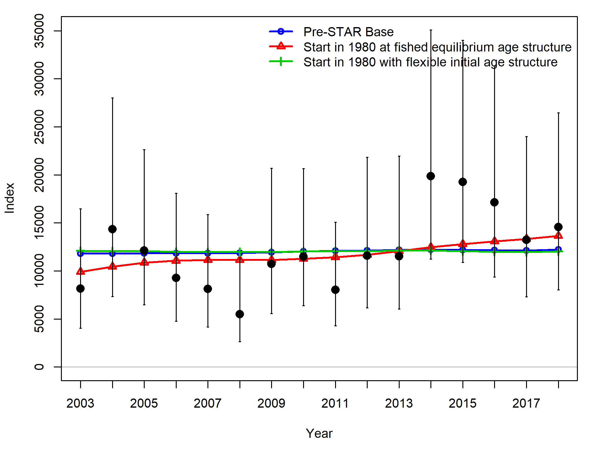
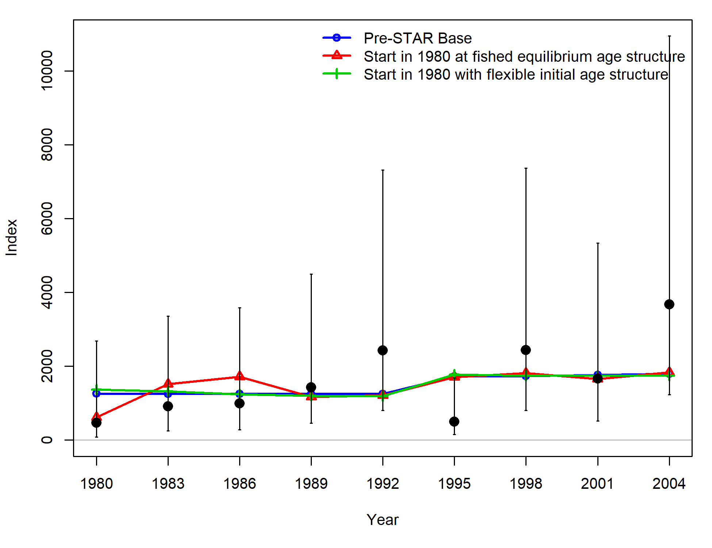
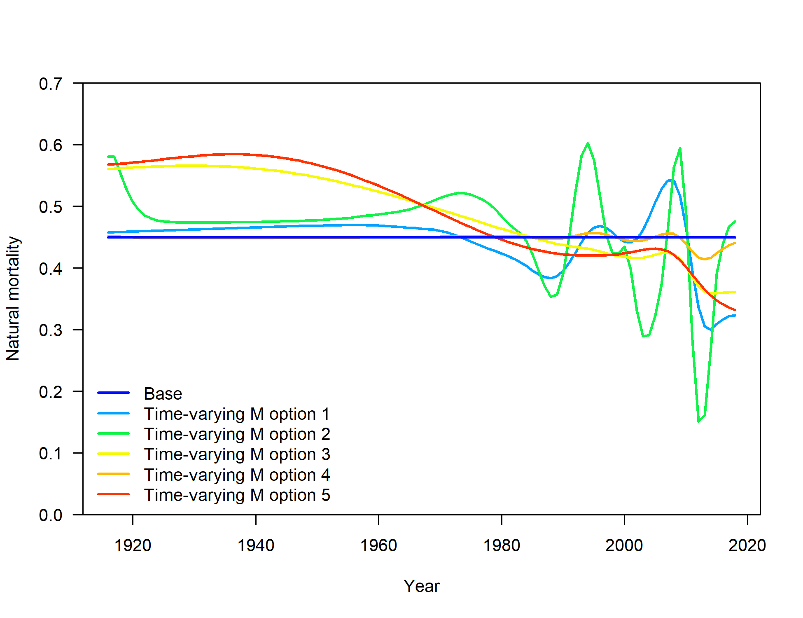
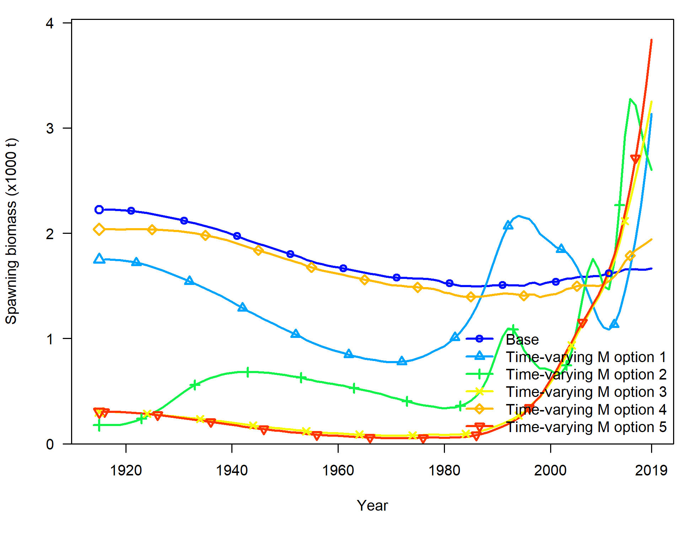
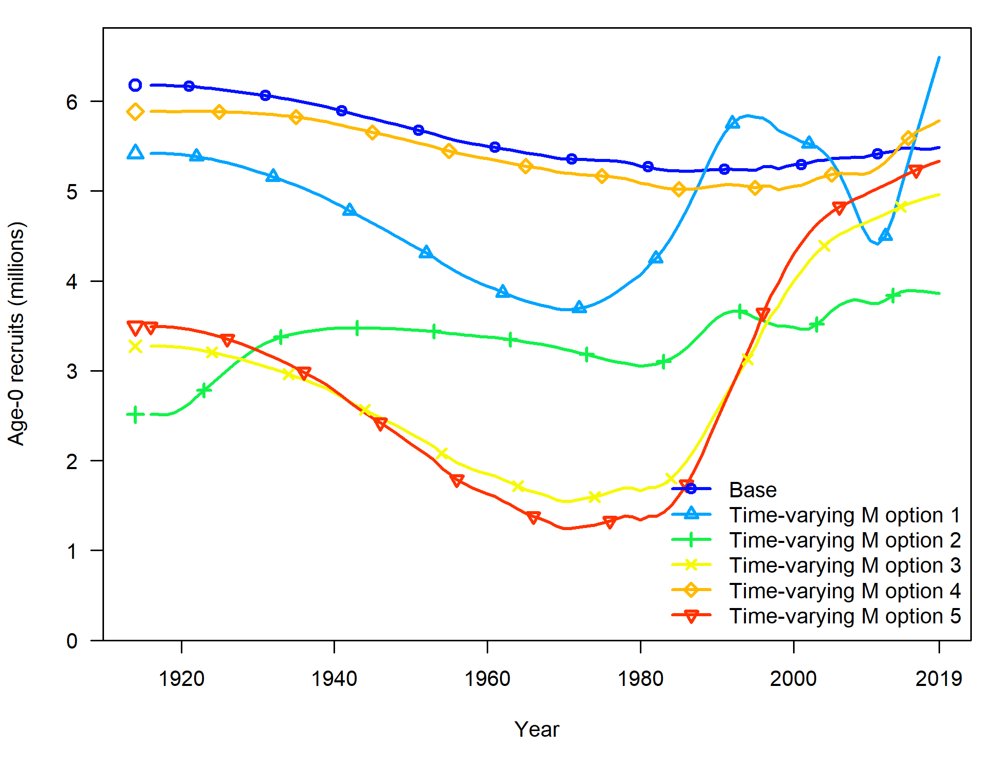
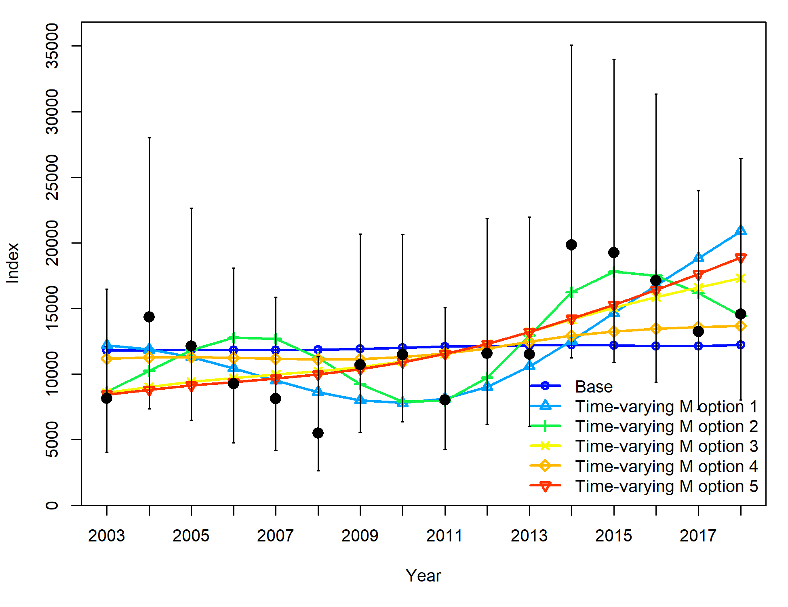
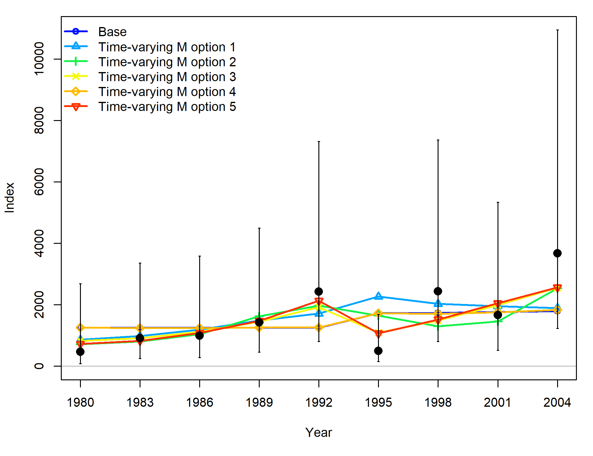
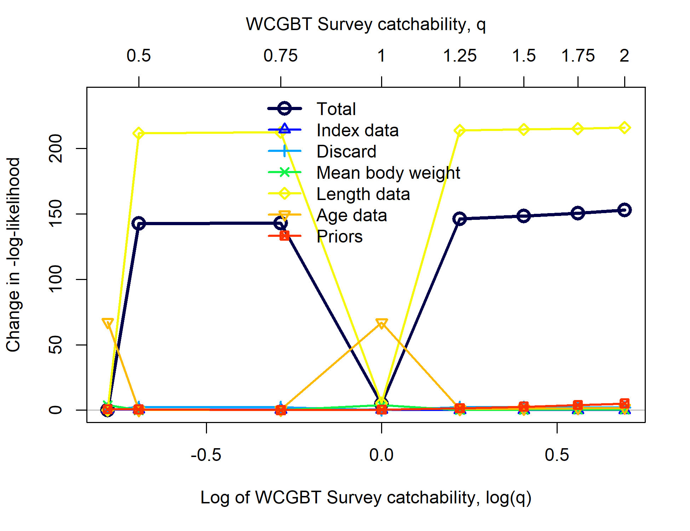
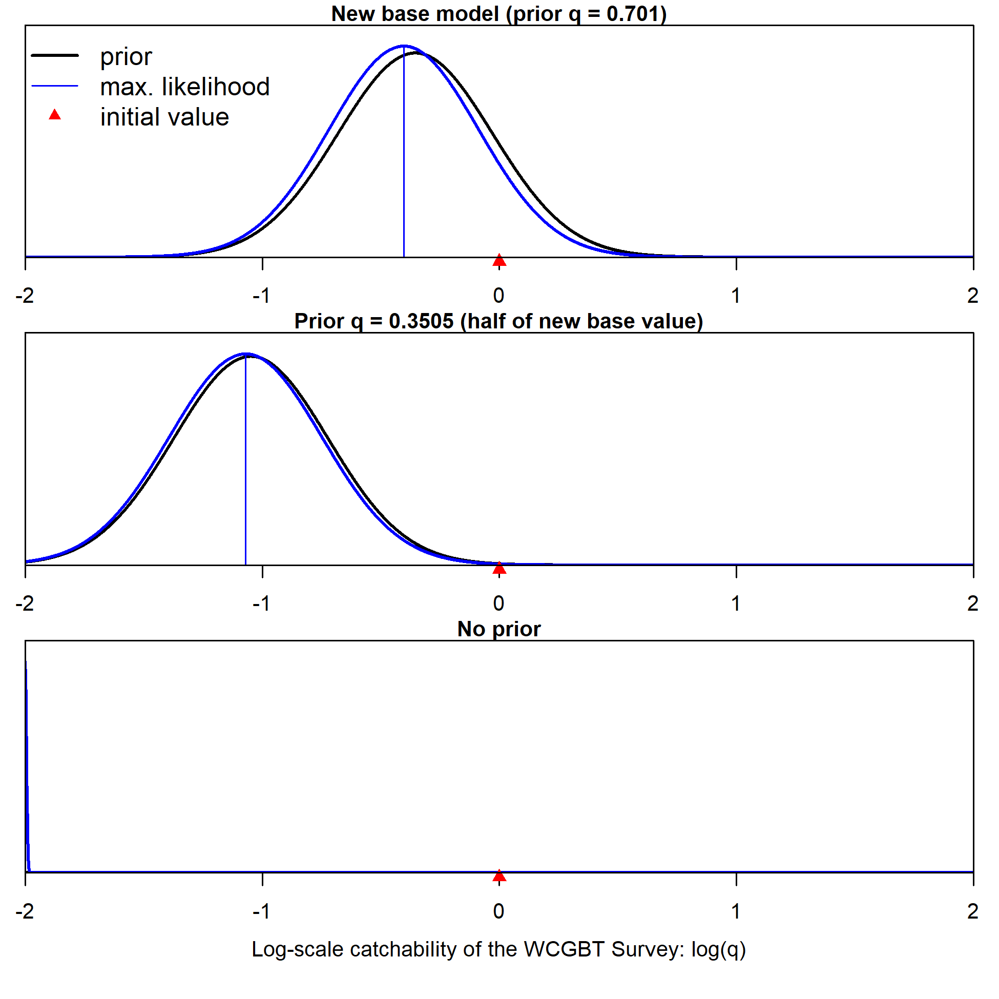

<!-- ************************************************************************************************--> 
<!-- **********************************BEGIN APPENDICES**********************************************--> 
<!-- ************************************************************************************************--> 
\FloatBarrier
\newpage

<!-- ************************************DATAFILE(S)************************************************--> 

# Appendix B. Figures associated with responses to STAR Requests {-}

<!--  -->

\vspace{1.5cm}

\noindent
\begin{minipage}{\linewidth}% to keep image and caption on one page
\makebox[\linewidth]{%        to center the image
  \includegraphics[keepaspectratio=true,width=6in]{Figures/survey_estimates_by_depth_with_shallow.png}}
\captionof{figure}{Extrapolated catch rates (upper panel) and estimated biomass after adjustment for area of each bin (lower panel). The gray regions indicate those depths outside the survey}\label{fig:survey_estimates_by_depth_with_shallow}%
\begin{centering}
range which were extrapolated based on catch rates from the commercial bottom trawl fishery. The extrapolated biomass is equal to 25.8\% of the total biomass (extrapolated plus surveyed area).
\end{centering}
\end{minipage}

\newpage

<!-- ************************************DATAFILE(S)************************************************--> 

# Appendix C. Auxiliary files {-}
The listed files are available as auxiliary files to accompany the assessment document:

\begin{enumerate}
  \item Numbers at age (BigSkate2019_supplementary_tables.xlsx)
  \item The `r spp` Stock Synthesis input files
  
  \begin{enumerate}
    \item BSKT2019_data.ss
    \item BSKT2019_control.ss
    \item forecast.ss
    \item starter.ss
  \end{enumerate}
\end{enumerate}
