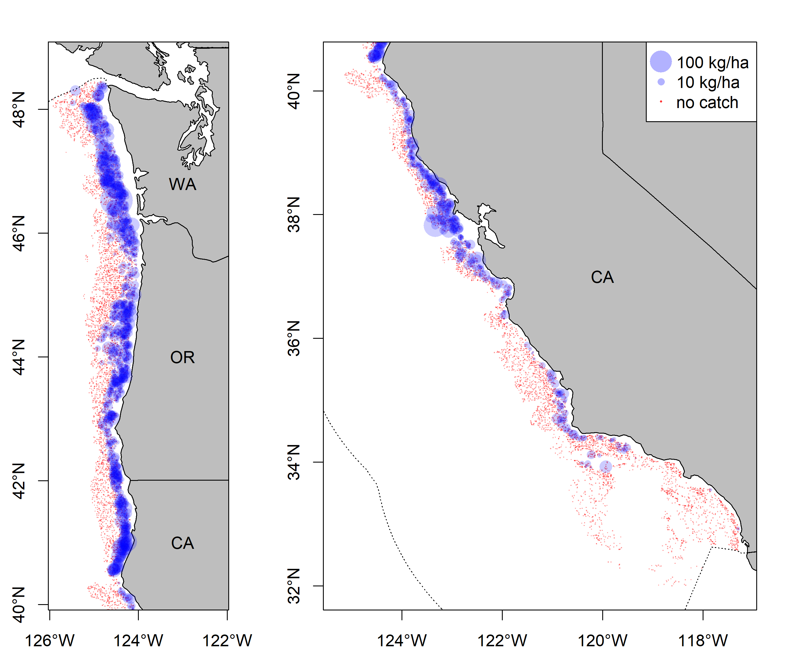
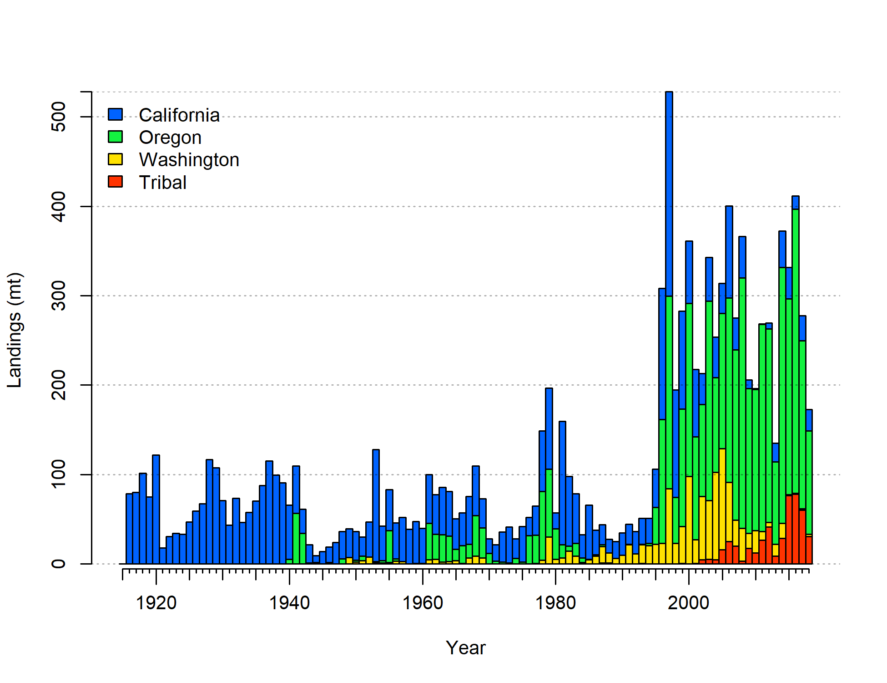
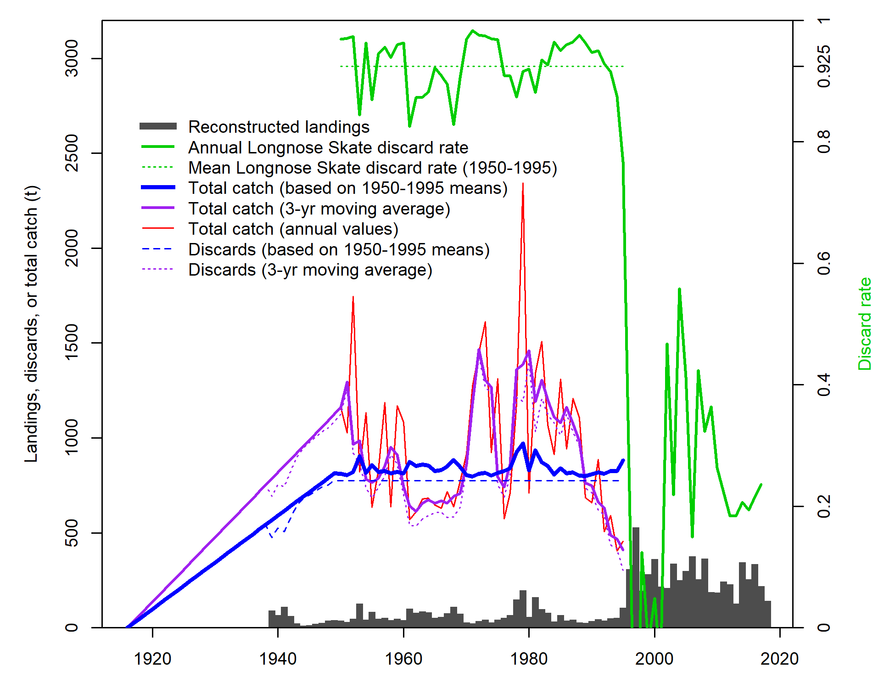
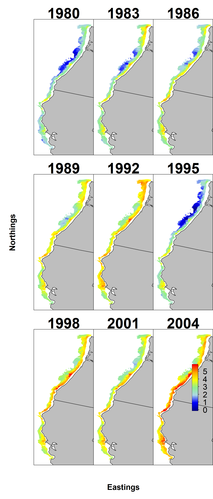
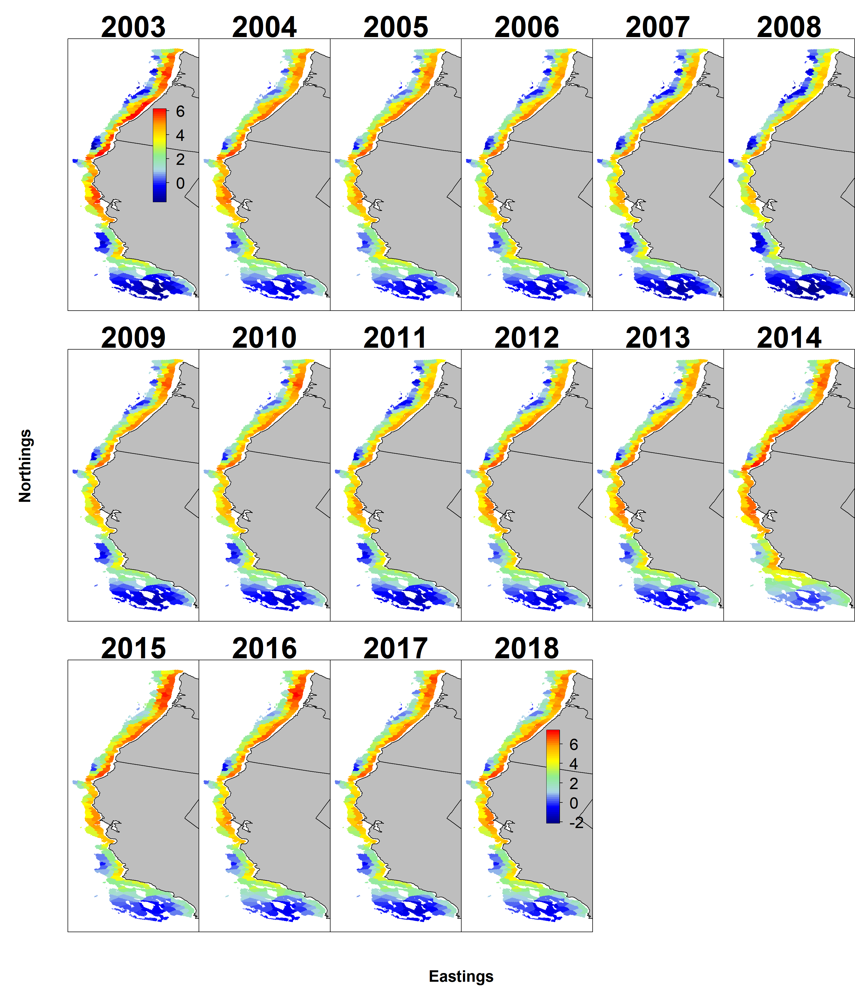
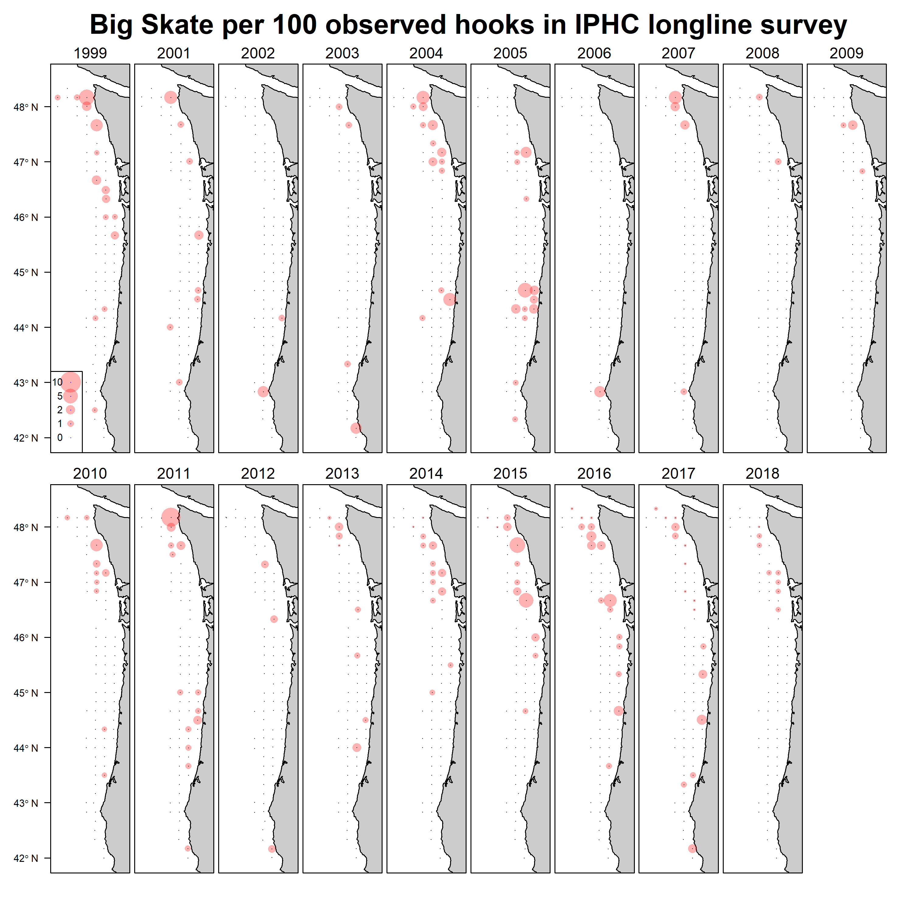

<!-- ====================================================================== -->
<!-- **************************             ******************************* --> 
<!-- **************************BEGIN FIGURES******************************* --> 
<!-- **************************             ******************************* -->
<!-- ====================================================================== -->
\newpage

# Figures

## Data Figures

<!-- ====================================================================== --> 
<!-- *********************INTRODUCTION FIGURES***************************** --> 
<!-- ====================================================================== --> 

<!-- ********************************************************************** --> 
<!-- *************************Data FIGURES********************************* --> 
<!-- ********************************************************************** -->

<!-- [H] to control floating -->

\begin{figure}[!h]
\begin{centering}
\includegraphics{r4ss/plots_mod1/data_plot.png}
\caption{Summary of data sources used in the `r mod1_label`.}\label{fig:data_plot}
\end{centering}
\end{figure}

\newpage

<!--  -->

\FloatBarrier

\newpage

<!-- [H] to control floating -->

\begin{figure}[!h]
\begin{centering}
\includegraphics{Figures/survey_hauls_map.png}
\caption{Map showing the distribution of Big Skate within the area covered by the West Coast Groundfish Bottom Trawl Survey aggregated over the years 2003--2018.}\label{fig:survey_hauls_map}
\end{centering}
\end{figure}

\newpage

<!--  -->

\FloatBarrier

\FloatBarrier

<!-- ********************************************************************** -->
<!-- ****************Fleet xx Index FIGURES************************* -->
<!-- ********************************************************************** --> 

\FloatBarrier

\FloatBarrier
<!-- ********************************************************************** -->
<!-- ***************Fleet xx index FIGURES*********************--> 
<!-- ********************************************************************** -->

\FloatBarrier

\FloatBarrier

<!-- ********************************************************************** -->
<!-- ***************Fleet xx index FIGURES********************--> 
<!-- ********************************************************************** -->

\FloatBarrier

<!-- ********************************************************************** -->
<!-- *************Recreational onboard observer FIGURES******************** --> 
<!-- ********************************************************************** -->

\FloatBarrier

